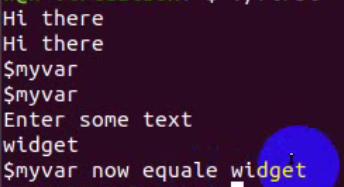

# SHELL 脚本编程 #

bashshell

版本

/bin/bash --version

**管道和重定向**

##重定向>

1.将输出保存到某处

vim output.log

2.追加>>

3.同时输出错误 2>&1

 	g++ -o main main.cpp >output.log 2>&1

所以这里2>&1 的意思就是将标准错误也输出到标准输出(即报错内容也输出到out.log)当中

##管道|

将两条命令合为一条命令使用

	ps | sort >output1.log

（sort对文本首字进行排序）

##SHELL脚本编程

在shell脚本的开头往往有一句话来定义使用哪种sh解释器来解释脚本。

目前研发送测的shell脚本中主要有以下两种方式：

	#!/bin/sh

	#!/bin/bash    (推荐   sh是bash的“子集”)

sh一般设成bash的软链

[work@zjm-testing-app46 cy]$ ll /bin/sh

lrwxrwxrwx 1 root     root          4 Nov 13   2006 /bin/sh -> bash

在一般的linux系统当中（如redhat），使用sh调用执行脚本相当于打开了bash的POSIX标准模式

也就是说 /bin/sh 相当于 /bin/bash --posix

所以，sh跟bash的区别，实际上就是bash有没有开启posix模式的区别

so，可以预想的是，如果第一行写成 #!/bin/bash --posix，那么脚本执行效果跟#!/bin/sh是一样的（**遵循posix的特定规范，有可能就包括这样的规范：“当某行代码出错时，不继续往下解释”**）

详见`c_cpp_advanced POSIX`介绍

shell脚本：

	#!/bin/bash

	for file in *
	do
  	      if grep -q POSIX $file
  	      then
  	              echo $file
  	      fi
	done

	exit 0

执行:
方法1. 直接调用shell，把脚本文件当作参数

	/bin/bash test.sh

方法2. 修改文件权限，使之能执行
（看到不可执行)

使用chmod +x test.sh 使之成为可执行文件 

./test.sh即可

输出：

##变量

设置一个变量,如：

	sa=Hello

	echo=$sa

则输出Hello

也可以使用`read sa`为sa赋值

例如：

结果：

**系统的环境变量：**

环境变量	说明

    $HOME	当前用户的家目录
    $PATH	以冒号分隔的用来搜索命令的目录列表
    $PS1	命令提示符，通常是$字符，但在bash中，你可以使用一些更复杂的值。
    $PS2	二级提示符，用来提示后续的输入，通常是>字符
    $IFS	输入域分隔符。当shell读取输入时，它给出用来分隔单词的一组字符，他们通常是空格，制表符和换行符
    $0	Shell脚本的名字
    $#	传递给脚本的参数个数
    $$	Shell脚本的进程号，脚本程序通常会用它来生成一个唯一的临时文件。
    

参数变量	说明

    $1,$2,...	脚本程序的参数
    $*	在一个变量中列出所有的参数，各个参数之间用环境变量IFS中的第一个字符分隔开。
    $@	它是$*的一个精巧的变体，它不使用IFS环境变量，所有即使IFS为空，参数也不会挤在一起

    set a b c
    echo $@

实践环境变量：需要./test.sh 参数1 参数2

## 3、控制结构 ##

shell有一组控制结果，它们与其他程序设计语言中的控制结构很相似；

    (1) if语句
    (2) elif语句
    (3) 一个与变量相关的问题
    (4) for语句
    (5) while语句
    (6) until语句
    (7) case语句
    (8) 命令列表
    (9) 语句块

##if条件判断

    文件条件测试	结果
    -d  file	如果文件是一个目录测试结果为真
    -e  file	如果文件存在则结果为真。要注意的是历史上-e选项不可移植，所以通常使用的是-f选项
    -f  file	如果文件是一个普通文件则结果为真
    -g  file	如果文件的set-group-id位被设置则结果为真
    -r  file	如果文件可读则结果为真
    -s  file	如果文件的大小不为0则结果为真
    -u  file	如果文件的set-user-id位被设置则结果为真
    -w  file	如果文件可写则结果为真
    -x  file	如果文件可执行则结果为真

查找文件/bin/bash是否存在

	#!/bin/bash

	if [ -f /bin/bash ]
	then
	        echo "file exist"
	fi

	exit 0

shell的字符串判断
    
	#!/bin/bash

	echo "time day/night"

	read time

	if [ time = "day" ]
	then
	        echo "day"
	elif [ time = "night" ]
	then
	        echo "night"
	else
 	       echo "other time"
	fi

	exit 0

**注意if [ time = "day" ]里面一定要留5个空格 【重要】**

`set nu`可以在vim记事本上显示行号

##for循环

例如：

	#!/bin/bash

	for foo in a b 42
	do      
      	  echo $foo
	done

	exit 0

foo变量会依次取a b 42 三个字符串的值，然后输出

例如：显示某个文件

	#!/bin/bash

	for file in $(ls i*.sh)
	do
 	       echo $file
	done

	exit 0

其实等价于`ls i*.sh`

##while循环

	#!/bin/bash

	echo "please enter the password!"
	read password
	while [ "$password" != "3.1415926" ]
	do
 	       echo "error,please try again!"
 	       read password
	done

	echo "success!"
	exit 0
注意：`while [ "$password" != "3.1415926" ]`使用`"$password"`可以兼顾enter输入的情况

##case判断

	#!/bin/bash

	echo "Is this time day or night?(yes/no)"

	read answer

	case "$answer" in
  	     yes | y) echo "goodday!";;
   	     no | n) echo "goodnight!";;
   	     *) echo "other!";;
	esac #反写过来

	exit 0

注：`no | n) echo "goodnight!";;`也可以改为`[nN]*)echo "goodnight!";;`表示Nn都可以

##逻辑判断

	#!bin/bash

	if [ -f ./logic.sh ] || [ -f ./case_test.sh ]
	then
 	       echo "one of them exist!"
	fi

	exit 0

##函数

	#!/bin/bash

	parameter="global variable"

	func()
	{
		local parameter="local variable"
 	    echo "function is running!"
		echo $parameter
	}

	echo "script start"
	func
	echo $parameter
	echo "script end"

	exit 0

示例2：

传入的参数是通过"$1"(或者"$2")由外层参数传递进入函数的；while 循环通过return 0/1跳出