# linux 系统概述 #
**Linux系统支持X86，ARM等大多数常见硬件架构和TCP./IP等主流网络协议，有良好的跨平台性能，应用面极其广阔**

**linux系统可以应用于许多嵌入式设备**

linux下层-上层Android/IOS 系统

嵌入式设备的存储容量不是很大 而windows操作系统比较大 所以linux操作系统用在嵌入式设备的比较多

嵌入式开发

当前工作：嵌入式开发-人脸识别模块 +服务器开发

编译器：gcc、g++、gdb、make、bash、shell、vim

## DOS系统于linux系统比较 ##
1.DOS系统不区分大小写(.bat del 删除)

2.Linux系统对于用户权限的控制比较严格

## 具体shell命令 ##
## **ls -l可以查看创建日期和权限** ##

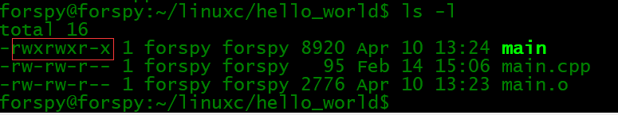

rwx表示可读可写可执行 一共是3组表示三个用户 owner(所有者)-group(组用户)-other(其他用户)

可以看到main程序是111 111 101 为775

可以使用chmod 777 main表示拥有最高权限

ls -lh 易读方式输出

## **ps -a可以查看进程** ##

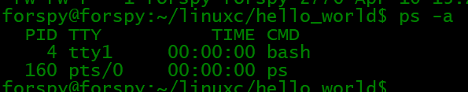

kill -9 进程pid 可以结束进程

sudo su进入管理员权限

exit退出当前权限返回上一层权限

## **grep命令**正则匹配 ##

该命令常用于分析一行的信息，若当中有我们所需要的信息，就将该行显示出来，该命令通常与管道命令一起使用，用于对一些命令的输出进行筛选加工等等，它的简单语法为

    grep [-acinv] [--color=auto] '查找字符串' filename
    它的常用参数如下：
    -a ：将binary文件以text文件的方式查找数据
    -c ：计算找到‘查找字符串’的次数
    -i ：忽略大小写的区别，即把大小写视为相同
    -v ：反向选择，即显示出没有‘查找字符串’内容的那一行

例如：显示main所在的那一行

	grep --color=auto 'main' main.cpp
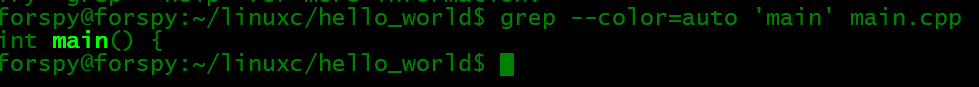

例如：把ls -l的输出中包含字母main（不区分大小写）的内容输出

	ls -l | grep -i 'main'

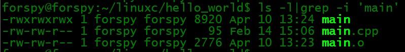

## **find命令** ##

    find是一个基于查找的功能非常强大的命令，相对而言，它的使用也相对较为复杂，参数也比较多，所以在这里将给把它们分类列出，它的基本语法如下：
    find [PATH] [option] [action]
     
    # 与时间有关的参数：
    -mtime n : n为数字，意思为在n天之前的“一天内”被更改过的文件；
    -mtime +n : 列出在n天之前（不含n天本身）被更改过的文件名；
    -mtime -n : 列出在n天之内（含n天本身）被更改过的文件名；
    -newer file : 列出比file还要新的文件名
    # 例如：
    find ./ -mtime 0 # 在当前目录下查找今天之内有改动的文件
     
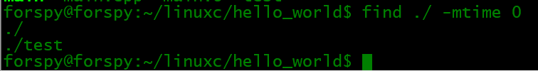

    # 与用户或用户组名有关的参数：
    -user name : 列出文件所有者为name的文件
    -group name : 列出文件所属用户组为name的文件
    -uid n : 列出文件所有者为用户ID为n的文件
    -gid n : 列出文件所属用户组为用户组ID为n的文件
    # 例如：
    find ./ -user forspy # 在当前目录找出所有者为forspy的文件

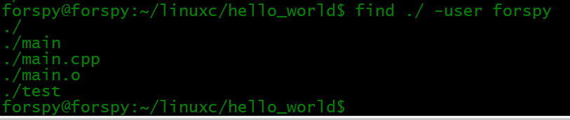

    # 与文件权限及名称有关的参数：
    -name filename ：找出文件名为filename的文件
    -size [+-]SIZE ：找出比SIZE还要大（+）或小（-）的文件
    -tpye TYPE ：查找文件的类型为TYPE的文件，TYPE的值主要有：一般文件（f)、设备文件（b、c）、
     目录（d）、连接文件（l）、socket（s）、FIFO管道文件（p）；
    -perm mode ：查找文件权限刚好等于mode的文件，mode用数字表示，如0755；
    -perm -mode ：查找文件权限必须要全部包括mode权限的文件，mode用数字表示
    -perm +mode ：查找文件权限包含任一mode的权限的文件，mode用数字表示
    
    
    # 例如：
    find ./ -name 'main.cpp' # 查找当前文件夹下文件名为main.cpp的文件
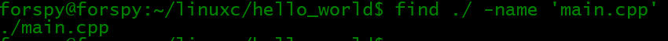

    find ./ -perm 0777 # 查找当前目录中文件权限的0777的文件
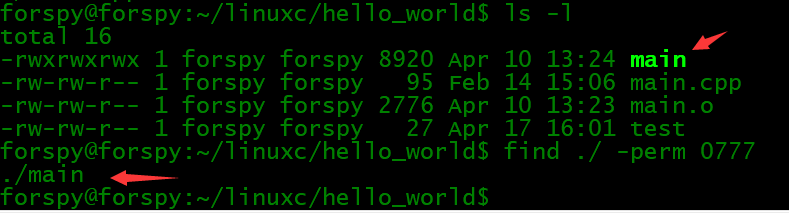

    find ./ -size +1k # 查找当前目录中大于12KB的文件，注意c表示byte
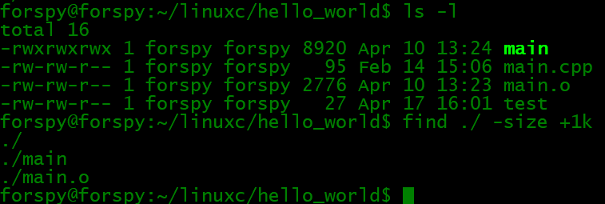

##cp命令

先使用mkdir在当前文件夹下面生成一个测试文件夹

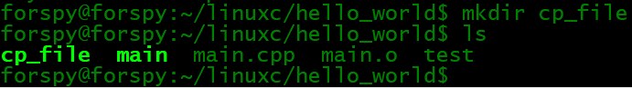

    该命令用于复制文件，copy之意，它还可以把多个文件一次性地复制到一个目录下，它的常用参数如下： 
    -a ：将文件的特性一起复制
    -p ：连同文件的属性一起复制，而非使用默认方式，与-a相似，常用于备份
    -i ：若目标文件已经存在时，在覆盖时会先询问操作的进行
    -r ：递归持续复制，用于目录的复制行为
    -u ：目标文件与源文件有差异时才会复制

把文件main、test复制到cp_file里面

	cp main test ./cp_file/ 

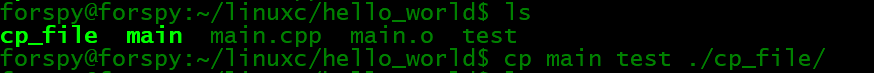

##【谨慎！】rm命令
该命令用于删除文件或目录，remove之间，它的常用参数如下：
-f ：就是force的意思，忽略不存在的文件，不会出现警告消息
-i ：互动模式，在删除前会询问用户是否操作
-r ：递归删除，最常用于目录删除，它是一个非常危险的参数

例如：
	rm -i file # 删除文件file，在删除之前会询问是否进行该操作
	rm -rf dir # 强制删除目录dir中的所有文件(包括这个目录)

## ps命令 ##
    该命令用于将某个时间点的进程运行情况选取下来并输出，process之意，它的常用参数如下：
    -A ：所有的进程均显示出来
    -a ：不与terminal有关的所有进程
    -u ：有效用户的相关进程
    -x ：一般与a参数一起使用，可列出较完整的信息
    -l ：较长，较详细地将PID的信息列出
    其实我们只要记住ps一般使用的命令参数搭配即可，它们并不多，如下：
	ps #基本ps
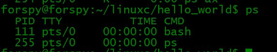

    ps aux # 查看系统所有的进程数据[推荐]
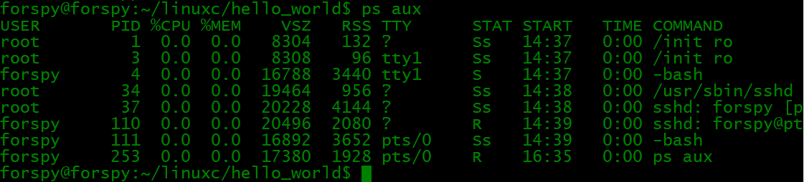

    ps ax # 查看不与terminal有关的所有进程

    ps -lA # 查看系统所有的进程数据

    ps axjf # 查看连同一部分进程树状态

##9、kill命令
该命令用于向某个工作（%jobnumber）或者是某个PID（数字）传送一个信号，它通常与ps和jobs命令一起使用，它的基本语法如下：

    kill -signal PID
    signal的常用参数如下：
    注：最前面的数字为信号的代号，使用时可以用代号代替相应的信号。
    1：SIGHUP，启动被终止的进程
    2：SIGINT，相当于输入ctrl+c，中断一个程序的进行
    9：SIGKILL，强制中断一个进程的进行
    15：SIGTERM，以正常的结束进程方式来终止进程
    17：SIGSTOP，相当于输入ctrl+z，暂停一个进程的进行
    例如：
    # 以正常的结束进程方式来终于第一个后台工作，可用jobs命令查看后台中的第一个工作进程
    kill -SIGTERM %1 
    # 重新改动进程ID为PID的进程，PID可用ps命令通过管道命令加上grep命令进行筛选获得
    kill -SIGHUP PID

##10、killall命令
    该命令用于向一个命令启动的进程发送一个信号，它的一般语法如下：
    killall [-iIe] [command name]
    它的参数如下：
    -i ：交互式的意思，若需要删除时，会询问用户
    -e ：表示后面接的command name要一致，但command name不能超过15个字符
    -I ：命令名称忽略大小写
    # 例如：
    killall -SIGHUP syslogd # 重新启动syslogd

##11、file命令【推荐】
该命令用于判断接在file命令后的文件的基本数据，因为在Linux下文件的类型并不是以后缀为分的，所以这个命令对我们来说就很有用了，它的用法非常简单，基本语法如下：
file filename
例如：
file ./main

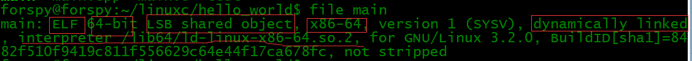

file ./main.cpp

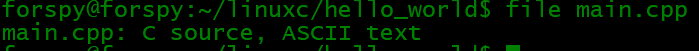

##12、tar命令
    该命令用于对文件进行打包，默认情况并不会压缩，如果指定了相应的参数，它还会调用相应的压缩程序（如gzip和bzip等）进行压缩和解压。它的常用参数如下：
    -c ：新建打包文件
    -t ：查看打包文件的内容含有哪些文件名
    -x ：解打包或解压缩的功能，可以搭配-C（大写）指定解压的目录，注意-c,-t,-x不能同时出现在同一条命令中
    -j ：通过bzip2的支持进行压缩/解压缩
    -z ：通过gzip的支持进行压缩/解压缩
    -v ：在压缩/解压缩过程中，将正在处理的文件名显示出来
    -f filename ：filename为要处理的文件
    -C dir ：指定压缩/解压缩的目录dir
    上面的解说可以已经让你晕过去了，但是通常我们只需要记住下面三条命令即可：
    压缩：tar -jcv -f filename.tar.bz2 要被处理的文件或目录名称
    查询：tar -jtv -f filename.tar.bz2
    解压：tar -jxv -f filename.tar.bz2 -C 欲解压缩的目录
    注：文件名并不定要以后缀tar.bz2结尾，这里主要是为了说明使用的压缩程序为bzip2

例如：压缩

	tar -czf main.tar.gz main
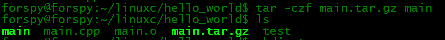

解压：

	tar -xzvf main.tar.gz
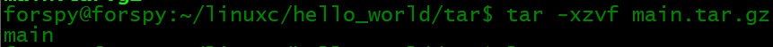

压缩：
-cvf 打包成.tar  命名 .tar  解压 -xvf
-czf 打包并压缩成gzip 命名.tar.gz  解压 -xzvf
-cjf 打包并压缩成bzip2 命名.tar.bz2 解压 -xjvf

##13、cat命令
该命令用于查看文本文件的内容，后接要查看的文件名，通常可用管道与more和less一起使用，从而可以一页页地查看数据。例如：

cat text | less # 查看text文件中的内容

注：这条命令也可以使用less text来代替（q退出）

##14、chgrp命令
该命令用于改变文件所属用户组，它的使用非常简单，它的基本用法如下：

chgrp [-R] dirname/filename
-R ：进行递归的持续对所有文件和子目录更改
例如：

chgrp forspy -R ./dir # 递归地把dir目录下中的所有文件和子目录下所有文件的用户组修改为forspy

##15、chown命令
该命令用于改变文件的所有者，与chgrp命令的使用方法相同，只是修改的文件属性不同，不再详述。

##16、chmod命令
该命令用于改变文件的权限，一般的用法如下：

chmod [-R] xyz 文件或目录

-R：进行递归的持续更改，即连同子目录下的所有文件都会更改

同时，chmod还可以使用u（user）、g（group）、o（other）、a（all）和+（加入）、-（删除）、=（设置）跟rwx搭配来对文件的权限进行更改。

例如：

chmod 0755 file # 把file的文件权限改变为-rxwr-xr-x

chmod g+w file # 向file的文件权限中加入用户组可写权限

##19、gcc命令
    对于一个用Linux开发C程序的人来说，这个命令就非常重要了，它用于把C语言的源程序文件，编译成可执行程序，由于g++的很多参数跟它非常相似，所以这里只介绍gcc的参数，它的常用参数如下：
    -o ：output之意，用于指定生成一个可执行文件的文件名
    -c ：用于把源文件生成目标文件（.o)，并阻止编译器创建一个完整的程序
    -I ：增加编译时搜索头文件的路径
    -L ：增加编译时搜索静态连接库的路径
    -S ：把源文件生成汇编代码文件
    -lm：表示标准库的目录中名为libm.a的函数库
    -lpthread ：连接NPTL实现的线程库
    -std= ：用于指定把使用的C语言的版本
     
    # 例如：
    # 把源文件test.c按照c99标准编译成可执行程序test
    gcc -o test test.c -lm -std=c99
    #把源文件test.c转换为相应的汇编程序源文件test.s
    gcc -S test.c

##20、time命令
    该命令用于测算一个命令（即程序）的执行时间。它的使用非常简单，就像平时输入命令一样，不过在命令的前面加入一个time即可，例如：
    time ./process
    time ps aux
    
    在程序或命令运行结束后，在最后输出了三个时间，它们分别是：
    user：用户CPU时间，命令执行完成花费的用户CPU时间，即命令在用户态中执行时间总和；
    system：系统CPU时间，命令执行完成花费的系统CPU时间，即命令在核心态中执行时间总和；
    real：实际时间，从command命令行开始执行到运行终止的消逝时间；
    注：用户CPU时间和系统CPU时间之和为CPU时间，即命令占用CPU执行的时间总和。实际时间要大于CPU时间，因为Linux是多任务操作系统，往往在执行一条命令时，系统还要处理其它任务。另一个需要注意的问题是即使每次执行相同命令，但所花费的时间也是不一样，其花费时间是与系统运行相关的。

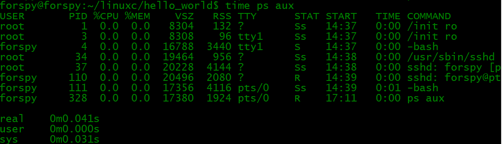

## 其他shell命令 ##

**ifconfig 查看ip情况**

**使用uname -r查看内核版本**

注意WSL(兼容linux内核)和linux虚拟机中的内核其实是不一致的(对于那些需要Linux内核的服务)，所以会不会对后续有影响，待解决？

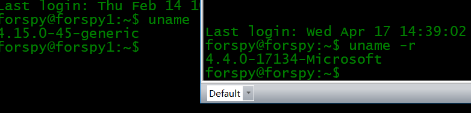

其他相关命令：

	arch 显示机器的处理器架构(1) 
	uname -m 显示机器的处理器架构(2) 
	uname -r 显示正在使用的内核版本 
	pwd 显示工作路径 
	cp dir/* . 复制一个目录下的所有文件到当前工作目录 
	ln -s file1 lnk1 创建一个指向文件或目录的软链接 
	ln file1 lnk1 创建一个指向文件或目录的物理链接 
	最常用用法：touch fileA
	如果fileA存在，使用touch指令可更改这个文件或目录的日期时间，包括存取时间和更改时间；
	如果fileA不存在，touch指令会在当前目录下新建一个空白文件fileA。

## man +shell命令/函数=帮助 ##

## 用户和群组 ##
    groupadd group_name 创建一个新用户组 
    groupdel group_name 删除一个用户组 
    groupmod -n new_group_name old_group_name 重命名一个用户组 
    useradd -c "Name Surname " -g admin -d /home/user1 -s /bin/bash user1 创建一个属于 "admin" 用户组的用户 
    useradd user1 创建一个新用户 
    userdel -r user1 删除一个用户 ( '-r' 排除主目录) 
    usermod -c "User FTP" -g system -d /ftp/user1 -s /bin/nologin user1 修改用户属性 
    passwd 修改口令 
    passwd user1 修改一个用户的口令 (只允许root执行) 
    chage -E 2005-12-31 user1 设置用户口令的失效期限 
    pwck 检查 '/etc/passwd' 的文件格式和语法修正以及存在的用户 
    grpck 检查 '/etc/passwd' 的文件格式和语法修正以及存在的群组 
    newgrp group_name 登陆进一个新的群组以改变新创建文件的预设群组 

## 查看文件内容  ##
    cat file1 从第一个字节开始正向查看文件的内容 
    tac file1 从最后一行开始反向查看一个文件的内容 
    more file1 查看一个长文件的内容 
    less file1 类似于 'more' 命令，但是它允许在文件中和正向操作一样的反向操作 
    head -2 file1 查看一个文件的前两行 
    tail -2 file1 查看一个文件的最后两行 
    tail -f /var/log/messages 实时查看被添加到一个文件中的内容 
    cat file1 file2 ... | command <> file1_in.txt_or_file1_out.txt general syntax for text manipulation using PIPE, STDIN and STDOUT 
    cat file1 | command( sed, grep, awk, grep, etc...) > result.txt 合并一个文件的详细说明文本，并将简介写入一个新文件中 
    cat file1 | command( sed, grep, awk, grep, etc...) >> result.txt 合并一个文件的详细说明文本，并将简介写入一个已有的文件中 
    grep Aug /var/log/messages 在文件 '/var/log/messages'中查找关键词"Aug" 
    grep ^Aug /var/log/messages 在文件 '/var/log/messages'中查找以"Aug"开始的词汇 
    grep [0-9] /var/log/messages 选择 '/var/log/messages' 文件中所有包含数字的行 
    grep Aug -R /var/log/* 在目录 '/var/log' 及随后的目录中搜索字符串"Aug" 
    sed 's/stringa1/stringa2/g' example.txt 将example.txt文件中的 "string1" 替换成 "string2" 
    sed '/^$/d' example.txt 从example.txt文件中删除所有空白行 
    sed '/ *#/d; /^$/d' example.txt 从example.txt文件中删除所有注释和空白行 
    echo 'esempio' | tr '[:lower:]' '[:upper:]' 合并上下单元格内容 
    sed -e '1d' result.txt 从文件example.txt 中排除第一行 
    sed -n '/stringa1/p' 查看只包含词汇 "string1"的行 
    sed -e 's/ *$//' example.txt 删除每一行最后的空白字符 
    sed -e 's/stringa1//g' example.txt 从文档中只删除词汇 "string1" 并保留剩余全部 
    sed -n '1,5p;5q' example.txt 查看从第一行到第5行内容 
    sed -n '5p;5q' example.txt 查看第5行 
    sed -e 's/00*/0/g' example.txt 用单个零替换多个零 
    cat -n file1 标示文件的行数 
    cat example.txt | awk 'NR%2==1' 删除example.txt文件中的所有偶数行 
    echo a b c | awk '{print $1}' 查看一行第一栏 
    echo a b c | awk '{print $1,$3}' 查看一行的第一和第三栏 
    paste file1 file2 合并两个文件或两栏的内容 
    paste -d '+' file1 file2 合并两个文件或两栏的内容，中间用"+"区分 
    sort file1 file2 排序两个文件的内容 
    sort file1 file2 | uniq 取出两个文件的并集(重复的行只保留一份) 
    sort file1 file2 | uniq -u 删除交集，留下其他的行 
    sort file1 file2 | uniq -d 取出两个文件的交集(只留下同时存在于两个文件中的文件) 
    comm -1 file1 file2 比较两个文件的内容只删除 'file1' 所包含的内容 
    comm -2 file1 file2 比较两个文件的内容只删除 'file2' 所包含的内容 
    comm -3 file1 file2 比较两个文件的内容只删除两个文件共有的部分 

## 网络 - （以太网和WIFI无线） ##
	基本ifconfig
    ifconfig eth0 显示一个以太网卡的配置 
    ifup eth0 启用一个 'eth0' 网络设备 
    ifdown eth0 禁用一个 'eth0' 网络设备 
    ifconfig eth0 192.168.1.1 netmask 255.255.255.0 控制IP地址 
    ifconfig eth0 promisc 设置 'eth0' 成混杂模式以嗅探数据包 (sniffing) 
    dhclient eth0 以dhcp模式启用 'eth0' 
    route -n show routing table 
    route add -net 0/0 gw IP_Gateway configura default gateway 
