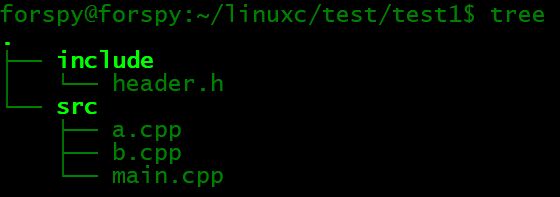

#开发系统导引、shell程序设计

系统头文件所在位置 /usr/include

linux系统版本的目录 /sys

库文件
.a 静态库
.so 共享库(动态库)

静态库在编译生成可执行程序阶段就进入，用到一次生成一个副本，导致生成的可执行程序很大(链接完以后和原来的库文件就没有关系了)，后期更新需要重新编译链接

直接输入tree 可以看到

##代码：

a.cpp：

    #include<iostream>
    #include "../include/header.h"
    void Hello(char* str)
    {
    std::cout<<str<<std::endl;
    }

b.cpp:

    #include<iostream>
    #include"../include/header.h"
    void Hi(char* str)
    {
    std::cout<<str<<std::endl;
    }

main.cpp:

    #include "../include/header.h"
    #include<iostream>
    
    int main()
    {
    Hello("str1");
    Hi("str2");
    return 0;
    }

头文件header.h:

    #ifndef __header_h
    #define __header_h
    void Hello(char* str);
    void Hi(char* str);
    #endif

**编译：先使用`gcc -c a.cpp b.cpp main.cpp`将cpp编译成.o文件**,也可以在编译过程就链接头文件 gcc -c -o a.o a.cpp -I ../include/(单个单个编译)，也可以整体编译g++ -c a.cpp b.cpp main.cpp -I ../include/

**链接：`g++ -o main main.o a.o b.o`链接，也可以使用`g++ -o main main.o a.o b.o -I ../include/`指定头文件的方式**